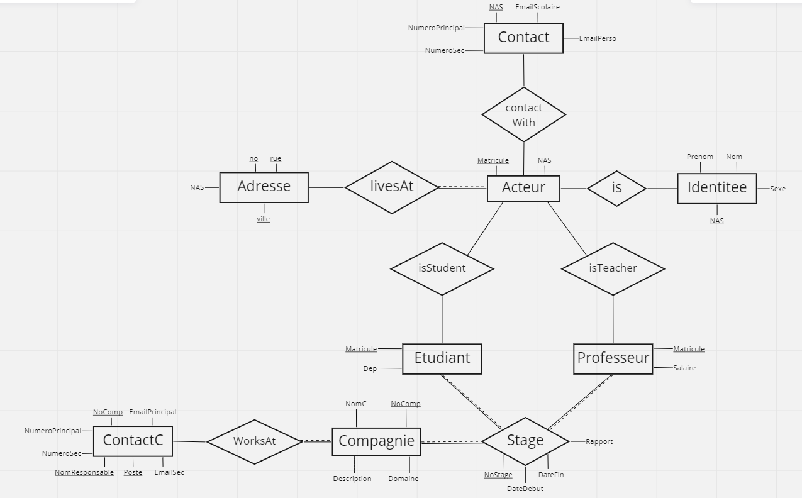
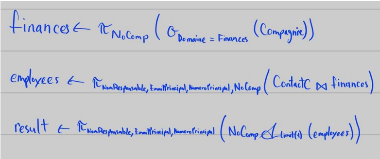
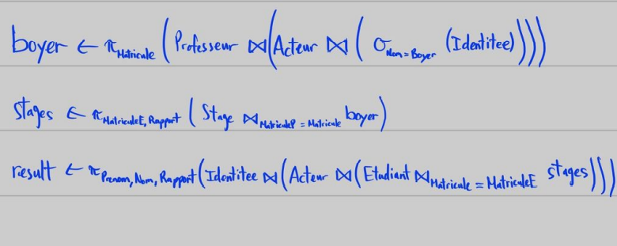

# SQL

<pre>
This was a project for the "Database" class. We were tasked to create a database for a university to manage internships.
</pre>

 

We started by creating an *Entity-Relationship* diagram. This diagram is used to plan and organise the logic behind the SQL database. 

  

 

Each table looks like this :

- Acteur(`Matricule`, NAS)
- Contact(`#NAS`, NumeroPrincipal, NumeroSec, EmailScolaire, EmailPerso)
- Identitee(`#NAS`, Prenom, Nom, Sexe)
- Adresse(`#NAS`, `Num`, `rue`, `ville`)
- Etudiant(`#Matricule`, Dep)
- Professeur(`#Matricule`, Salaire)
- Compagnie(`NoComp`, NomC, Domaine, Description)
- ContactC(`#NoComp`, `NomResponsable`, `Poste`, EmailPrincipal, EmailSec, NumeroPrincipal, NumeroSec)
- Stage(`NoStage`, #MatriculeE, #MatriculeP, #NoComp, Rapport, DateDebut, DateFin)

*#* : represents Foreign keys  
`{text}` : represents Primary keys

---

<pre>
The SQL script creating the database can be found in this project as "Script.sql" or "sql.txt".
</pre>

 

Furthermore, we were asked to create 4 `SQL Views`. First by writting "Database Algebra" and then transforming it into *SQL*

 

### 1 - The first view represents the number of female students that had an internship at Tesla.

 

  

`Select count (*)`  
`From Acteur as a , Compagnie as c, Identitee as i, Etudiant as e, Stage as s`  
`Where i.sexe = 'Femme' AND c.nomC = 'Tesla' and a.nas = i.nas and a.matricule =`  
`e.matricule and s.matriculeE = a.matricule;`  

 

### 2 - Display a single manager as well as their primary email and phone number per company working in the field of finance.

 

  

`Select co.NomResponsable, co.NumeroPrincipal, co.EmailPrincipal`  
`From Compagnie as c, ContactC as co`  
`Where c.Domaine = 'Finance' and c.NoComp = co.NoComp Limit 1;`  

 

### 3 - Display the report with surname and first name of the students who have completed an internship with Mr. Boyer.

 

  

`Select s.Rapport, i.Nom, i.Prenom`  
`From Identitee as i, Etudiant as e, Professeur as p`  
`Join Acteur as a on (a.NAS = i.NAS AND a.Matricule = e.Matricule AND a.Matricule = p.Matricule)`  
`Join Stage as s on (s.MatriculeE = e.Matricule AND s.MatriculeP = p.Matricule)`  
`Where i.Nom = ‘Boyer’;`  

 

### 4 - Give the name of the company, the name of the people in charge and the main number of all internships that start during the month of June 2021.

 

  

`Select c.NomC, co.NomResponsable, co.NumeroPrincipal`  
`From ContactC as co`  
`Join Compagnie as c on co.NoComp = c.NoComp`  
`Join Stage as s on c.NoComp = s.NoComp`  
`Where s.DateDebut > '2021-06-01';`  

